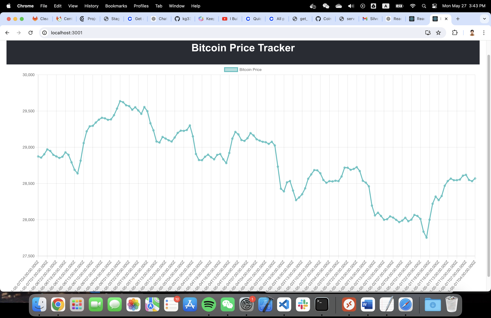
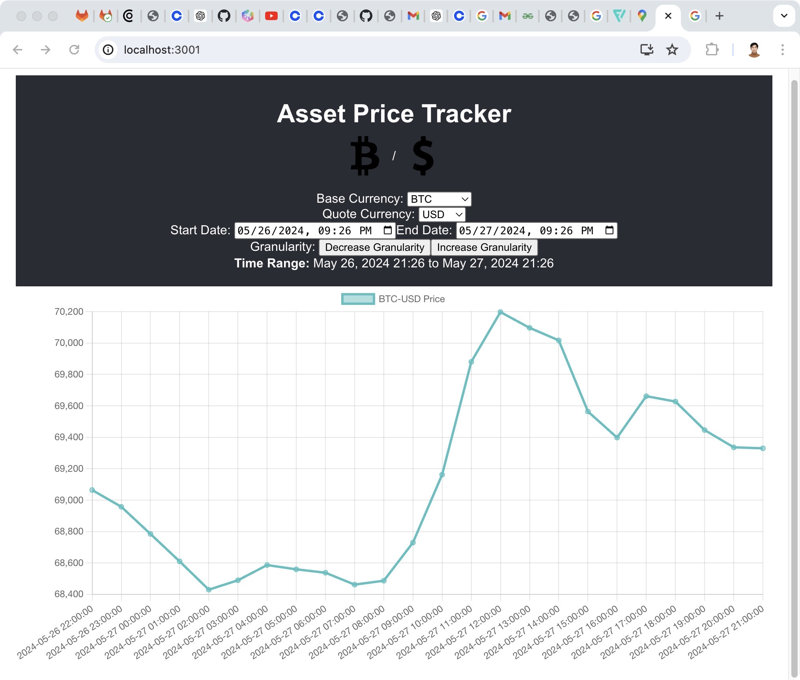
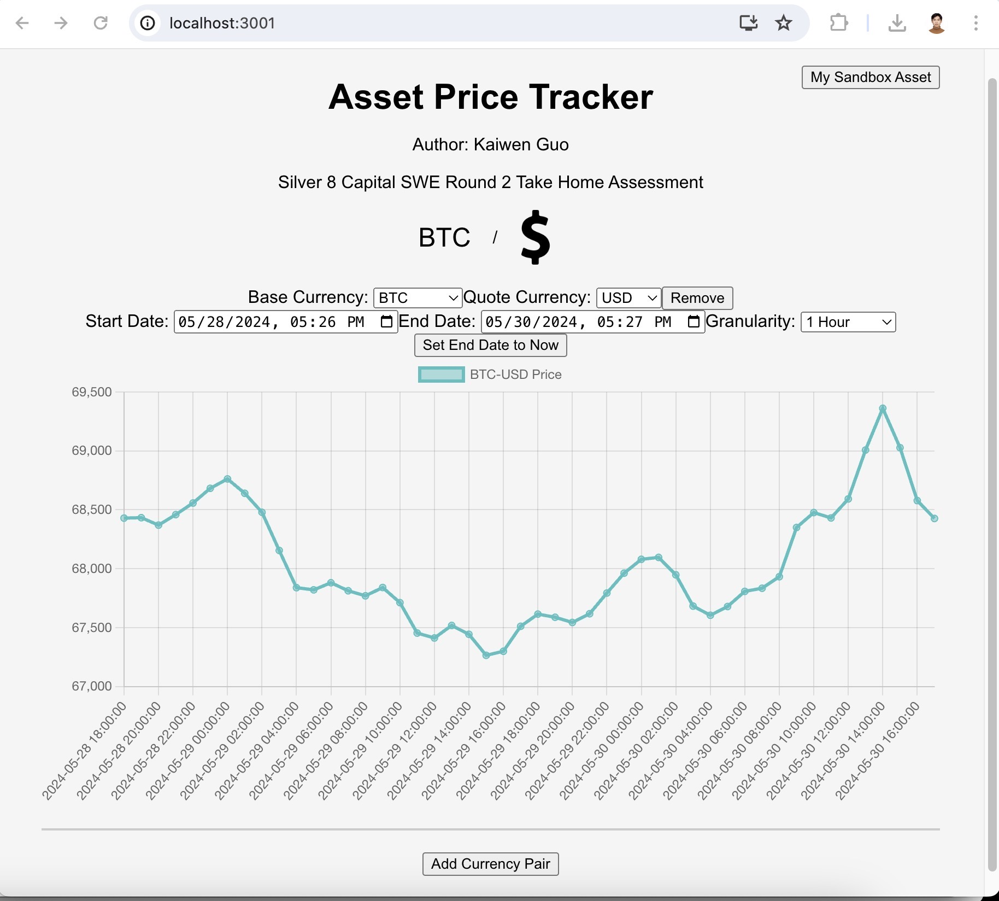

# This is the instructions for Silver 8 Capital SWE Round 2 Take Home Assignment. Author: Kaiwen Guo. Email: kg3354@nyu.edu 

## I will list the updates in a daily manner, such that it is easier to trace. 

## I have designed a similar web application before, which could be seen in https://github.com/kg3354/Jail-Database. It uses Flask to host the server, and used PHPMyAdmin for the database. 

## Day 1, May 25 2024 
I first retrieved the API from 1Password, and the API configuration for me is
```
passphrase: 0aeaqko06fge
secret: LPvA+3buf65E0eDgBe6cFCuSNXp5uv/jn/9d8gTLXgJIEkpBhI5ZBhcYFe1VmjyxR2+SBUHDJXPQId2oBuaAsA==
key: 01f1b83c19f7c29463da79a137e38f1d
docs: https://docs.cloud.coinbase.com/exchange/docs/sandbox
```

I tried to use existing Python libraries for Coinbase, but I do not want to violate the requirement 'Coinbase’s API'
Thus, I navigated to 

https://docs.cdp.coinbase.com/exchange/reference/exchangerestapi_getproducts/
https://docs.cdp.coinbase.com/exchange/reference/exchangerestapi_getproductcandles/

### To set up the environment:
To create a new package.json file:
```
    npm init -y
```
To install axois:
```
    npm install axios
```

I then created 2 simple NodeJs applications, one corresponding to each. The are called my_asset.js and bit_now.js

### my_asset.js: 

Only the get all known trading pair requires API authentication. I currently wrote the scirpts into the code directly, will modify into a config file or ini file in the future. 
The my_asset.js will return an array of variables including account id, currency, balance, availablity, hold, trading enabled, and pending enabled.
The outputs by running the script is:
```
(base) guobuzai@10-18-239-243 Coinbase_Web % node my_asset.js
Account Information:
Account ID: 9028c2b2-eb07-4f19-af23-bf7a8f5296d7
Currency: BAT (BAT)
Balance: 0.0000000000000000
Available: 0
Hold: 0.0000000000000000
Trading Enabled: true
Pending Deposit: 0.0000000000000000
---
Account ID: 1ac6c93b-0fb4-403d-9f61-b4ae88d84926
Currency: BTC (BTC)
Balance: 0.0000000000000000
Available: 0
Hold: 0.0000000000000000
Trading Enabled: true
Pending Deposit: 0.0000000000000000
---
Account ID: 25768de7-bc80-4216-a99f-6715044232d5
Currency: ETH (ETH)
Balance: 0.0000000000000000
Available: 0
Hold: 0.0000000000000000
Trading Enabled: true
Pending Deposit: 0.0000000000000000
---
Account ID: baece3e3-a118-4df1-a66c-5cf3bec51d49
Currency: EUR (EUR)
Balance: 0.0000000000000000
Available: 0
Hold: 0.0000000000000000
Trading Enabled: true
Pending Deposit: 0.0000000000000000
---
Account ID: ba0d968a-41a8-41ae-b3a8-41d5725a3892
Currency: GBP (GBP)
Balance: 0.0000000000000000
Available: 0
Hold: 0.0000000000000000
Trading Enabled: true
Pending Deposit: 0.0000000000000000
---
Account ID: ea5ddbdc-bcc6-4330-b893-b6d1f93a69f7
Currency: LINK (LINK)
Balance: 0.0000000000000000
Available: 0
Hold: 0.0000000000000000
Trading Enabled: true
Pending Deposit: 0.0000000000000000
---
Account ID: c2195bb8-a705-4335-84b4-b0398f9c0570
Currency: USD (USD)
Balance: 0.0000000000000000
Available: 0
Hold: 0.0000000000000000
Trading Enabled: true
Pending Deposit: 0.0000000000000000
---
Account ID: c480056b-bdfa-4b9f-bade-fbefbc55cbdf
Currency: USDC (USDC)
Balance: 0.0000000000000000
Available: 0
Hold: 0.0000000000000000
Trading Enabled: true
Pending Deposit: 0.0000000000000000
---
Account ID: ebd6b21c-40cf-4821-be70-5cb5faaa12d6
Currency: USDT (USDT)
Balance: 0.0000000000000000
Available: 0
Hold: 0.0000000000000000
Trading Enabled: true
Pending Deposit: 0.0000000000000000
---

```

### bit_now.js

The bit_now.js is then called the getproductcandles api and retrieving the bitcoin price within a time range identified by the user. The user needs to specify the start time, end time, and granularity. Many error checking was implemented, such as checking the format of user input, and adjust the granularity to match the required values: [60, 300, 900, 3600, 21600, 86400]. The default for starting time is a day earlier than 'now', the default end time is 'now', and default granularity is 3600(1 hour).
By using all default values, the outputs are:
```
(base) guobuzai@10-18-239-243 Coinbase_Web % node bit_now.js
Enter the start date and time (YYYY-MM-DDTHH:mm:ss) or type "default" for 1 day earlier: default
Enter the end date and time (YYYY-MM-DDTHH:mm:ss) or type "now" for the current time: now
Enter the granularity in seconds (default is 3600): 3600
Fetching data from 2024-05-24T20:34:56Z to 2024-05-25T20:34:58Z with granularity 3600 seconds...
[
  {
    'Date and Time': '5/25/2024, 4:00:00 PM',
    'Lowest Price (USD)': '$69067.86',
    'Highest Price (USD)': '$69220.84',
    'Opening Price (USD)': '$69146.93',
    'Closing Price (USD)': '$69103.68',
    'Trading Volume': '44.2722 BTC'
  },
  {
    'Date and Time': '5/25/2024, 3:00:00 PM',
    'Lowest Price (USD)': '$69101.64',
    'Highest Price (USD)': '$69260.51',
    'Opening Price (USD)': '$69198.27',
    'Closing Price (USD)': '$69146.92',
    'Trading Volume': '68.4709 BTC'
  },
  {
    'Date and Time': '5/25/2024, 2:00:00 PM',
    'Lowest Price (USD)': '$69048.47',
    'Highest Price (USD)': '$69236.06',
    'Opening Price (USD)': '$69056.32',
    'Closing Price (USD)': '$69198.27',
    'Trading Volume': '101.7339 BTC'
  },
  {
    'Date and Time': '5/25/2024, 1:00:00 PM',
    'Lowest Price (USD)': '$68911.86',
    'Highest Price (USD)': '$69093.14',
    'Opening Price (USD)': '$68938.48',
    'Closing Price (USD)': '$69055.35',
    'Trading Volume': '63.2276 BTC'
  },
  {
    'Date and Time': '5/25/2024, 12:00:00 PM',
    'Lowest Price (USD)': '$68849.72',
    'Highest Price (USD)': '$69053.99',
    'Opening Price (USD)': '$68937.55',
    'Closing Price (USD)': '$68938.48',
    'Trading Volume': '121.5922 BTC'
  },
  {
    'Date and Time': '5/25/2024, 11:00:00 AM',
    'Lowest Price (USD)': '$68841.52',
    'Highest Price (USD)': '$69203.37',
    'Opening Price (USD)': '$69015.89',
    'Closing Price (USD)': '$68937.55',
    'Trading Volume': '130.4668 BTC'
  },
  {
    'Date and Time': '5/25/2024, 10:00:00 AM',
    'Lowest Price (USD)': '$68927.10',
    'Highest Price (USD)': '$69087.06',
    'Opening Price (USD)': '$69023.83',
    'Closing Price (USD)': '$69015.38',
    'Trading Volume': '156.3055 BTC'
  },
  {
    'Date and Time': '5/25/2024, 9:00:00 AM',
    'Lowest Price (USD)': '$68878.62',
    'Highest Price (USD)': '$69235.75',
    'Opening Price (USD)': '$69110.35',
    'Closing Price (USD)': '$69023.83',
    'Trading Volume': '178.0134 BTC'
  },
  {
    'Date and Time': '5/25/2024, 8:00:00 AM',
    'Lowest Price (USD)': '$69013.75',
    'Highest Price (USD)': '$69297.32',
    'Opening Price (USD)': '$69093.92',
    'Closing Price (USD)': '$69115.27',
    'Trading Volume': '120.7703 BTC'
  },
  {
    'Date and Time': '5/25/2024, 7:00:00 AM',
    'Lowest Price (USD)': '$69087.29',
    'Highest Price (USD)': '$69605.03',
    'Opening Price (USD)': '$69369.70',
    'Closing Price (USD)': '$69093.63',
    'Trading Volume': '204.1125 BTC'
  },
  {
    'Date and Time': '5/25/2024, 6:00:00 AM',
    'Lowest Price (USD)': '$69002.04',
    'Highest Price (USD)': '$69454.07',
    'Opening Price (USD)': '$69075.24',
    'Closing Price (USD)': '$69369.70',
    'Trading Volume': '145.7753 BTC'
  },
  {
    'Date and Time': '5/25/2024, 5:00:00 AM',
    'Lowest Price (USD)': '$68833.10',
    'Highest Price (USD)': '$69140.49',
    'Opening Price (USD)': '$68867.58',
    'Closing Price (USD)': '$69080.69',
    'Trading Volume': '77.6684 BTC'
  },
  {
    'Date and Time': '5/25/2024, 4:00:00 AM',
    'Lowest Price (USD)': '$68723.64',
    'Highest Price (USD)': '$69050.00',
    'Opening Price (USD)': '$68738.75',
    'Closing Price (USD)': '$68867.57',
    'Trading Volume': '130.5912 BTC'
  },
  {
    'Date and Time': '5/25/2024, 3:00:00 AM',
    'Lowest Price (USD)': '$68615.11',
    'Highest Price (USD)': '$68796.39',
    'Opening Price (USD)': '$68638.23',
    'Closing Price (USD)': '$68738.75',
    'Trading Volume': '59.8174 BTC'
  },
  {
    'Date and Time': '5/25/2024, 2:00:00 AM',
    'Lowest Price (USD)': '$68587.22',
    'Highest Price (USD)': '$68731.07',
    'Opening Price (USD)': '$68696.08',
    'Closing Price (USD)': '$68639.08',
    'Trading Volume': '83.8710 BTC'
  },
  {
    'Date and Time': '5/25/2024, 1:00:00 AM',
    'Lowest Price (USD)': '$68680.63',
    'Highest Price (USD)': '$68790.14',
    'Opening Price (USD)': '$68750.49',
    'Closing Price (USD)': '$68696.08',
    'Trading Volume': '42.0502 BTC'
  },
  {
    'Date and Time': '5/25/2024, 12:00:00 AM',
    'Lowest Price (USD)': '$68660.74',
    'Highest Price (USD)': '$68809.89',
    'Opening Price (USD)': '$68733.19',
    'Closing Price (USD)': '$68750.41',
    'Trading Volume': '81.6989 BTC'
  },
  {
    'Date and Time': '5/24/2024, 11:00:00 PM',
    'Lowest Price (USD)': '$68635.84',
    'Highest Price (USD)': '$68891.10',
    'Opening Price (USD)': '$68800.00',
    'Closing Price (USD)': '$68733.19',
    'Trading Volume': '91.3976 BTC'
  },
  {
    'Date and Time': '5/24/2024, 10:00:00 PM',
    'Lowest Price (USD)': '$68585.06',
    'Highest Price (USD)': '$68816.50',
    'Opening Price (USD)': '$68598.34',
    'Closing Price (USD)': '$68800.00',
    'Trading Volume': '99.9624 BTC'
  },
  {
    'Date and Time': '5/24/2024, 9:00:00 PM',
    'Lowest Price (USD)': '$68525.12',
    'Highest Price (USD)': '$68707.96',
    'Opening Price (USD)': '$68525.13',
    'Closing Price (USD)': '$68598.63',
    'Trading Volume': '103.7157 BTC'
  },
  {
    'Date and Time': '5/24/2024, 8:00:00 PM',
    'Lowest Price (USD)': '$68487.44',
    'Highest Price (USD)': '$68674.99',
    'Opening Price (USD)': '$68545.52',
    'Closing Price (USD)': '$68525.13',
    'Trading Volume': '103.2338 BTC'
  },
  {
    'Date and Time': '5/24/2024, 7:00:00 PM',
    'Lowest Price (USD)': '$68506.52',
    'Highest Price (USD)': '$68776.69',
    'Opening Price (USD)': '$68776.69',
    'Closing Price (USD)': '$68547.80',
    'Trading Volume': '126.2111 BTC'
  },
  {
    'Date and Time': '5/24/2024, 6:00:00 PM',
    'Lowest Price (USD)': '$68662.80',
    'Highest Price (USD)': '$68871.88',
    'Opening Price (USD)': '$68867.58',
    'Closing Price (USD)': '$68776.68',
    'Trading Volume': '135.4972 BTC'
  },
  {
    'Date and Time': '5/24/2024, 5:00:00 PM',
    'Lowest Price (USD)': '$67800.00',
    'Highest Price (USD)': '$69013.83',
    'Opening Price (USD)': '$68833.74',
    'Closing Price (USD)': '$68868.15',
    'Trading Volume': '570.8575 BTC'
  }
]

```

Today's main goal is to know the two major API calls, and understand how to use them using NodeJs. 
The time used today is from Saturday, May 25, 2024 at 3:07 PM to Saturday, May 25, 2024 at 4:36 PM, a total of 1.5 Hours.

Today's work is pushed to GitHub:
https://github.com/kg3354/Coinbase_web.git


## Day 2, May 26 2024 

I first created a directory named day1, and I moved all the day1's work (get_all_know_trading_pairs.js and bit_now.js) into day1 directory for consistency.

Today is the day before Memorials day, thus I did not spend much time on the project. My goal for today is to have the backend and frontend skeleton ready using the most simple manner. They still use the same logic from bit_now.js, and their goal is to now be able to retrieve Bitcoin prices using web. 

I chose to use NodeJs Server and React frontend. I created 3 files, server_day2.js as the NodeJs Server, App.js to receive user input, and PriceChart.js to display the data. All the API calls was achieved in server_day2.js, the App.js sets up the basic structure of the user interface, and PriceChart.js is displaying the results of bitcoin price in a friendly manner. 

I first added the new packages for today’s task and the react directory named day2. The naming is to match each day’s work. 

```
npm install express axios cors

npx create-react-app day2
cd day2
npm install axios chart.js react-chartjs-2
npm install bootstrap
npm install chartjs-adapter-date-fns

```

I now made it possible for the server_day2.js and App.js to talk to each other, but I am encountering many different kinds of problems regarding the PriceChart.js. I believe it is due to the formating of the returned data, but i am not certain and need more testing. I am by current work saved and will continue next time. 

The total of hour spend today is 1 hour, from 5:30 to 6:24, and todays work is pushed to the same repo. 

Next time, i need to fix the request error, build the asset page, and more UI design. 


## Day 3, May 27 2024 - Approach 1

Today I found https://github.com/renaissancetroll/reactjs-crypto-api-dashboard/tree/master/src, which does similar functionality as what I was trying to accomplished yesterday. I recall that Mr Lim said that we could use all the resources we found online, thus I cloned this git repo and built from there.

Inside my Coinbase web directory,
```
mkdir day3
cd day3
git clone https://github.com/renaissancetroll/reactjs-crypto-api-dashboard.git
```

## Day 3, May 27 2024 - Approach 2

The previous approach did not work for me. It requires a lower version of Node.JS, and i do not want to downgrade it as more vulnerabilities could occur. I deleted that day3 folder and started again based on day2's work. I tried to make it more simple this time, limiting user input for now and will build on that.

Today the main focus is on 3 files, server_day3.js, App.js, and BitcoinPriceGraph.js. Their functionalities are the same as day2, but BitcoinPriceGraph.js replaced PriceChart.js from day2.

### Set Up

To set up the environment for server_day3.js, in the same directory, run

```
npm install express cors axios express-rate-limit moment moment-timezone

```

Then, navigate to day3 folder and then the src folder. To include all the necessary dependencies
```
cd src
npm install
npm install axios react-chartjs-2 chart.js @babel/plugin-proposal-private-property-in-object

```

Now by running both server_day3.js by
```
node server_day3.js
```
and then navigate to the day3 folder and running
```
npm start
```

### result
I get a very simple line graph of bitcoin price shown in 
 

It only contains a hard coded time range and granularity, which i will modify now directly on the server and corresponding files.

There are error logs when the granularity is too small similar to day 1's approach, and I updated App.js to remove the Update Button and automatically fetches data, just because i realized my original approach doesnt really the button and it is more user friendly this way. I then updated server_day3.js to make sure the end date does not exceed the current date. 

The App.js also didnt handle timezone correctly, and it is fixed in this update

### All product types

I realized that i am only playing wiht bitcoins for now, and i need to at least find all the product types coinbase api supports so that i can call.

The corresponding all_product.js is written in day3 folder, and to run it simply use
```
node all_produce.js
```

As a result, the result, which is a sequence of the following, was written to a text file named volume-summary.txt under directory day3. 
```
id
base_currency
quote_currency
display_name
market_types
spot_volume_24hour
spot_volume_30day
rfq_volume_24hour
rfq_volume_30day
conversion_volume_24hour
conversion_volume_30day
```

I can then retrieve the id, to let user choose their base currency and quote currency, and call the script to get the results they need. 

My next goal is to have the home page ready, and user can choose from there. 

Currently time spend from 3:11 PM to 5:37 PM, a total of 2 hours 20 min. Current work is also pushed to github.

## Day 3, May 27 2024 - Main page

The first thing i realized that is my previous approach to getting the trading pair is wrong. I called the wrong api, and i changed my Day1's instructions to what i wrongly used. That API call is actually getting my asset pairs from the sandbox. I wrote a new NodeJs file that actually gets the correct pair. 

The new all_product.js file does what I intentially do, which is getting the possible trading pairs. It generate a json file containing the useable pairs, and now I can choose the pairs freely.

to get the pair:

```
node all_product.js
```
And then manully move the currencyPairs.json to src. This needs to be changed for efficiency.

The currencyPairs.json looks like:
```
{
    "00": [
        "USD"
    ],
    "1INCH": [
        "BTC",
        "EUR",
        "GBP",
        "USD"
    ],
    "AAVE": [
        "BTC",
        "EUR",
        "GBP",
        "USD"
    ],
    "ABT": [
        "USD"
    ],
    "ACH": [
        "USD",
        "USDT"
    ],
    ...
    ...
    ...
    "ZRX": [
        "BTC",
        "EUR",
        "USD"
    ]
}

```

The new features for server_day3_mainpage update patch is that now user can choose base currency and quote currency generated from the get trading pair api call, and it dynamically change the drop down menu and the display currency cymbol. 

The current progress after running the server_day3_mainpage,js and npx start inside the day3-mainpage directory:



Needs to update by next time:
1. Add all the currency photo in the public/image directory. Currenly only contains USD and BTC. The photos are downloaded from https://www.flaticon.com/.
2. Display the granularity. I had another misunderstanding of granularity. Each dot represent a result, not the time displayed at the bottom. I thought that was the result I get from API calls, thus was confused on what get price api actually returns as the result gap varies depending my time range. Now i realized that each dot on the line graph was indeed the result, thus I can also display the granularity time. 
3. Maybe allow user to display the price of multiple currencies together?
4. Add the user asset feature to the web. The Sandbox keys should be passed in through a .ini file. 
5. Fix the all_product.js such that it runs when the server starts, and the output is generated to src folder. 

I spend from 7:05 to 9:21 on this part of the project. It is a total of 2 hours 20 minutes. It is pushed to github.

## Day 4 and Day 5, May 29, 30 2024 

This week is very busy for me, and i did not find time to write the documentation until May 30. 
### Update on Previous Work
I first realized that finding all the images for the currencies are not appliable, as there are thousands of them available on Coinbase.
Thus, I change place the base currency image into just a word display. This saved me time to search for all the images.
I still kept the image for the quote currency, to make the website looks better.

Another update I had is to enable users to add currency pairs. I initially tried to write multiple lines into the same graph, but I realized that different currencies have a wide range of different prices, it indeed looks worse. Thus, I added an add currency pair button, such that users can display more graphs at the bottom. I used a white line to separate them, also for visualization purposes.

Although I tried to add the auto refresh method, it did not work well. I think it is because I did not figure out how to automatically trigger the API call without breaking my time range protection function. I did add a set time to now button, which allowed one to set the end time to be 'now'. I will try to add this function back again later.

I did add the display granularity drop-down menu back. The two buttons approach before was redundant, and I think just having a drop down menu make it simple and looks good. 

### Key Modification (my_asset.js)

- I ensured that the start time cannot exceed 1 minute before the end time, and I ensured that the end time cannot exceed 1 minute before the start time. Both typing and using the drop down calendar are being protected.

- I embedded the execution of all_product.js into the start of the server. Thus, whenever the server starts, it gets all the current product pairs and write to teh working src directory for the react application to use.

- I added the user sandbox asset feature to the main page. User can now just click on the top right corner where it says 'My Sandbox Asset' to access their sandbox asset. It displays as its own, users are able to scroll down the asset menu without moving the main page.  It also used the App.css, which was not being used before

- I changed all the 'localhost:3000' into 'http://${window.location.hostname}:3000', such that other machines in the network could also view this website. This is supported by React. Once you run npm start, you can either view it via localhost or the IP address. Only the IP address way could be reached by all machines in the network, and this change enabled them to retrieve the data without any issues

### Conclusion on May 30

I believe this project is coming to an end. Tomorrow I will start writing the testing required for this project, as well as the environment settings. I will start writing all the necessary steps including what package to install for M1 users to reproduce this project.

Today's work is pushed to github. Total hour spend 6:20 - 7:20, 8:45 - 9:31.


## Day 6, May 31 2024 

Today's main focus will be the testing plan. Tomorrow I will create a virtual environment to list all the necessary steps and write out the final report. For today, as the instruction stated that we are not required to test the application extensively or achieve a high code coverage score, I will list my testing plan below.

The detailed testing plan is written under: TestingPlan.md

I also made the modification of my_asset.js, such that it gets Coinbase Sandbox information from the Asset.config. This is more secure and professional. 

I then created the final server.js, and the corresponding App.js directory. These are the final directory and server script that will be used. I also modified all_product.js such that the result json file is written to App/src instead of Day4/src

The display of the final product is shown below:



P.S. The TestingPlan.md is not final.

Todays work is pushed to github: https://github.com/kg3354/Coinbase_web.git
Total hour spend today: 4:37 - 5:31

## Day 7, June 1 2024 

Today I believe is the last day for me to be working on this project. I had great fun so far, and I am working on wraping it up.

The first thing is to clean up the TestingPlan.md so that it is more detailed and professional. 

### ChatGPT Chat Box
While i was cleaning up the TestingPlan.md, i realized that I can also add a simple ChatGPT api call to my project. That seems to be really relavent to digital currency, as the use of AI to do trading is the future. I modified the server.js and the App/src/App.js to achieve my goals

Another package needs to be included
```
npm install openai@^4.0.0
pip install openai
```

Since i used both openai_chat.py to do the actual openai api fetching job, it was trigger by and passing result to the server, and the server display it on my application via the App/src/ChatBox.js script. 

### Fixed bugs
While I was implementing the chatgpt feature, I fixed many bugs, including the quote currency not changing when base currency changes, and the time lock is not functioning as expected.

### Environment 

To meet the environment requirements, the best and most simple approach is completed via Docker
I wrote a Dockerfile, and use the following command to compile:

```
docker buildx build --platform linux/amd64,linux/arm64 -t kg3354/s8oa:latest --push .    
```

Since we need to make the application compatible across architectures including amd64 and arm64, we need to use docker buildx instead of a simple docker build

p.s. I also realized that App is not a good name, as app is usually the default naming. I renamed my working directory to s8oa

To run the application using docker, simply start docker and then 
```
docker pull kg3354/s8oa:latest
docker run -p 3000:3000 -p 3001:3001 kg3354/s8oa:latest

```
Then navigate to
```
http://localhost:3001
```

All mandatory requirements are met in my application, I am now writing the final report under README.md


